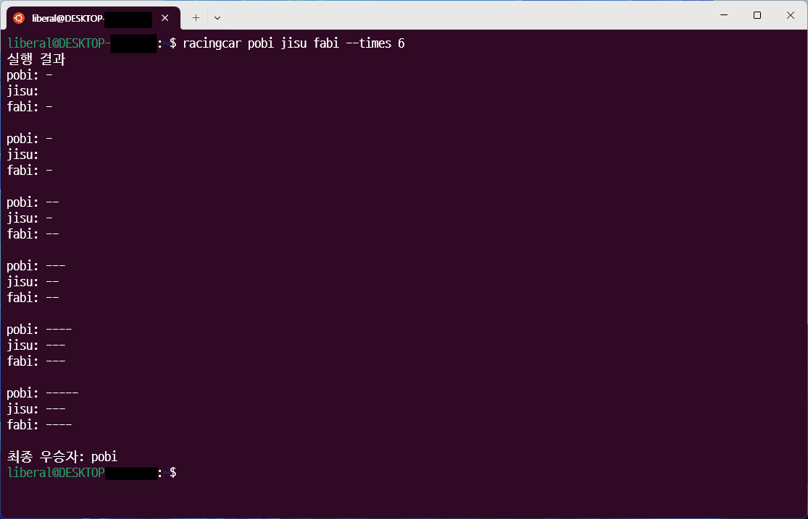

# Go로 만드는 자동차 경주


프리코스 과제 중 가장 인상깊었던 자동차 경주 과제를 Go 언어로 재현해보는 미션이다. racingcar 등의 명령어를 통해 실행되는 CLI 애플리케이션을 목표로 한다. 컴파일된 바이너리는 [릴리즈 페이지](https://github.com/liberaldev/precourse-8-racingcar-golang/releases)에서 다운로드 받을 수 있다.

GoLand 등 젯브레인즈 IDE에서 일관된 환경을 제공하기 위해 일부 IDE 설정 파일을 Github에 업로드하였다. 젯브레인즈 신버전 IDE는 `.idea` 폴더 안에 git에서 제외하는 파일들을 담은 `.gitignore` 파일을 생성해주는데 이를 이용하였다. [참고](https://intellij-support.jetbrains.com/hc/en-us/articles/206544839-How-to-manage-projects-under-Version-Control-Systems)

## 설치 방법
 1. [릴리즈 페이지](https://github.com/liberaldev/precourse-8-racingcar-golang/releases)에서 자신한테 맞는 환경의 바이너리를 받는다. 유닉스나 유닉스 라이크 환경은 `racingcar`로, 윈도우 환경은 `racingcar.exe` 바이너리 파일명을 변경하는 것을 강력히 권장한다.
 2. 기본적으로 `PATH` 환경변수가 설정되어 있는 폴더(예시로 맥과 일부 리눅스 배포판은 `~/.local/bin`이 `PATH`에 설정되어 있다)로 바이너리를 이동하거나, 혹은 바이너리가 위차한 폴더를 환경변수 `PATH`에 추가한다. 이 경우에는 각자의 환경에 맞게 `PATH` 환경변수를 갱신해야 한다.
 3. 유닉스나 유닉스 라이크의 경우 해당 바이너리 파일을 실행할 수 있도록 퍼미션을 조정한다. 왠만한 유닉스나 유닉스 라이크 환경에서는 `chmod +x (바이너리 파일 경로)`로 실행 권한을 주는 것이 가능하다.
 4. 터미널 등 명령줄에 `racing --help` 등으로 명령어를 입력해서 프로그램이 실행이 되는지 확인한다.

## 사용 방법
바이너리 파일명이 `racingcar`(윈도우 환경에서는 확장자 포함해서 `racingcar.exe`)일 때를 전제한 사용법니다.
```
사용법:
  racingcar [car1] [car2] [car3]... [flags]

플래그:
  -h, --help        도움말 표시
  -t, --times int   시도 횟수
```
## 기능 체크리스트
### `main.go`
- [x] 옵션 없는 인자는 자동차 이름, `--count` 인자는 횟수로 간주하도록 인자 파싱하기
- [x] 우승자 안내 문구 출력
### `cars.go`
- [x] 차 이름들로 이루어진 배열을 인자로 하여 `Cars` 구조체의 `cars` 필드를 초기화하는 메소드 구현.
- [x] 각 배열을 순회할때 0에서 9 사이에서 무작위 값을 구한 후 무작위 값이 4 이상의 경우 `cars`의 요소인 `Car` 구조체의 `steps` 필드의 수를 증가하는 메소드 구현
- [x] 자동차 이름 유효성 검사
- [x] `steps`의 수를 따라 정렬하는 메소드 구현
- [x] 승리자를 선정하는 메소드 구현
- [x] 얼마나 주행했는지를 출력하는 메소드 구현